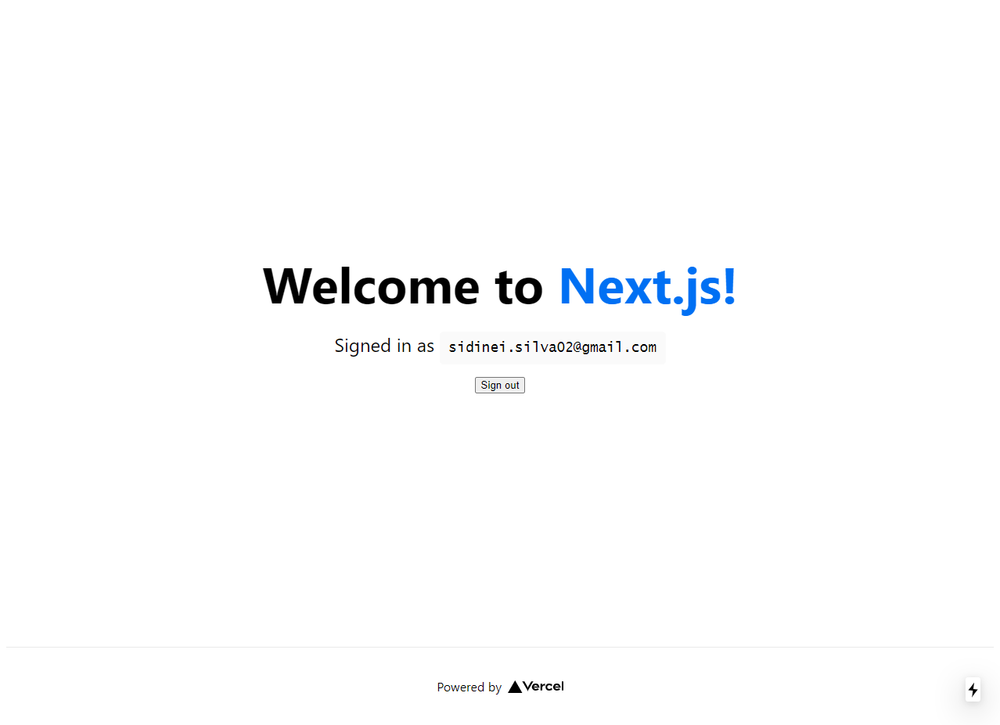

Este é um projeto de estudo, utilizando oauth para autenticação com nextJS.

Incluindo uma página  de login via github e uma página  index autenticada com opção de sair.




## Requisitos

- Banco de dados MongoDB
- OAuth do github. (Pode ser obtido através do seguinte link: https://github.com/settings/apps)

## Getting Started

- Crie um arquivo na pasta raiz ```.env.local```

- Inclua as seguintes variavies ambiente no arquivo criado:
  ```
  DATABASE_URL={url do banco mongo}
  GITHUB_CLIENT_ID={id do oauth github}
  GITHUB_CLIENT_SECRET={secret do oauth github}
  NEXTAUTH_URL=http://localhost:3000
  ```

- Abra [http://localhost:3000](http://localhost:3000) Para ver o resultado.

#### Estudo sobre next-auth criado por :
[](https://github.com/sidinei-silva) |
--- |
Sidinei Silva |
